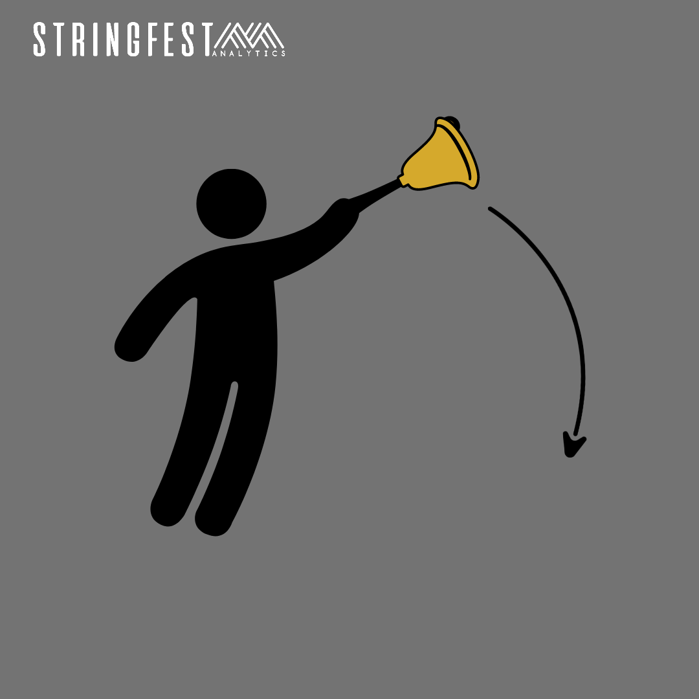
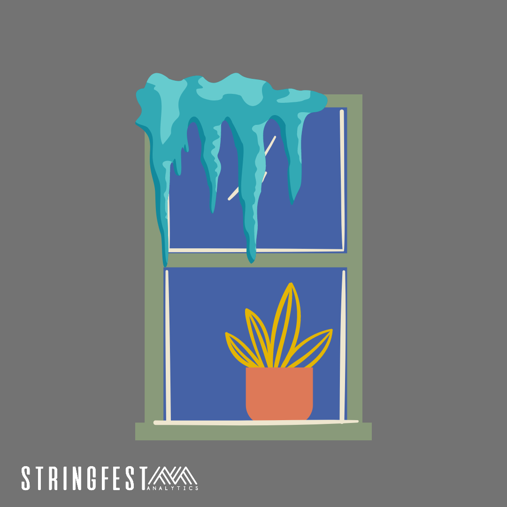
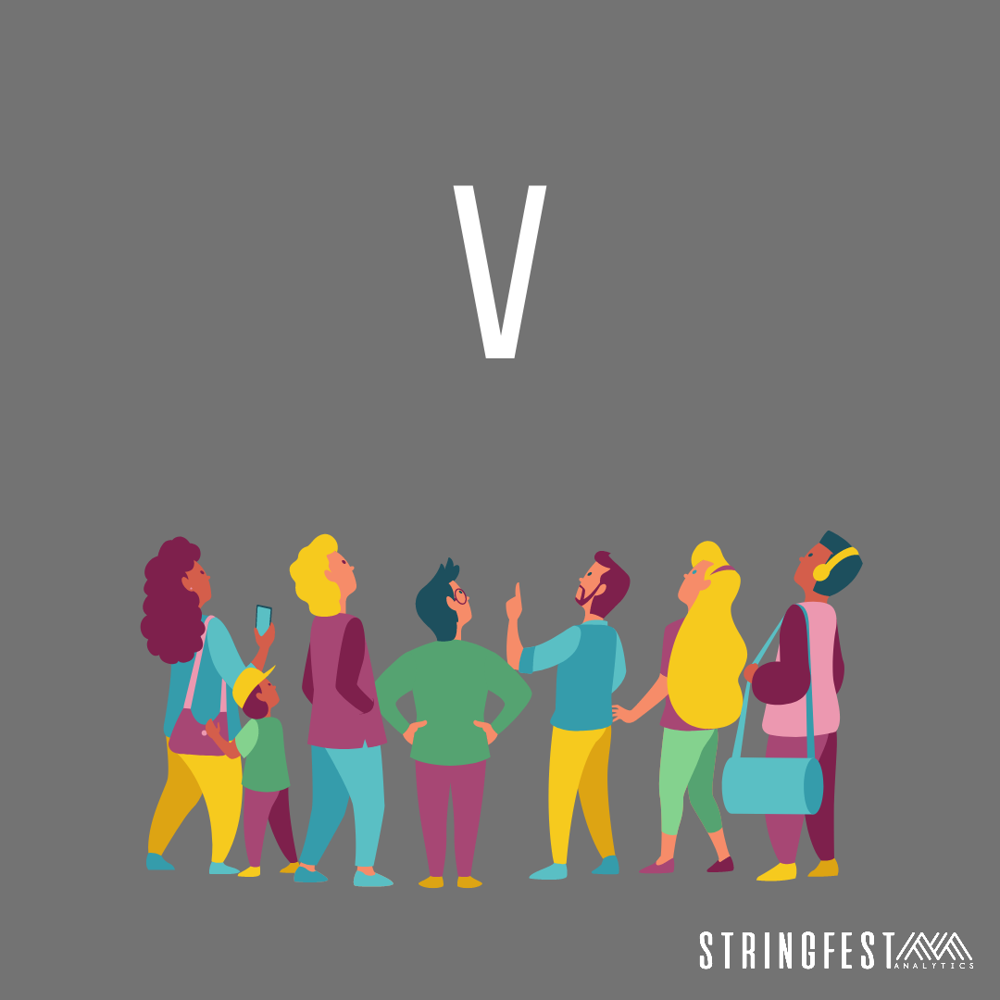
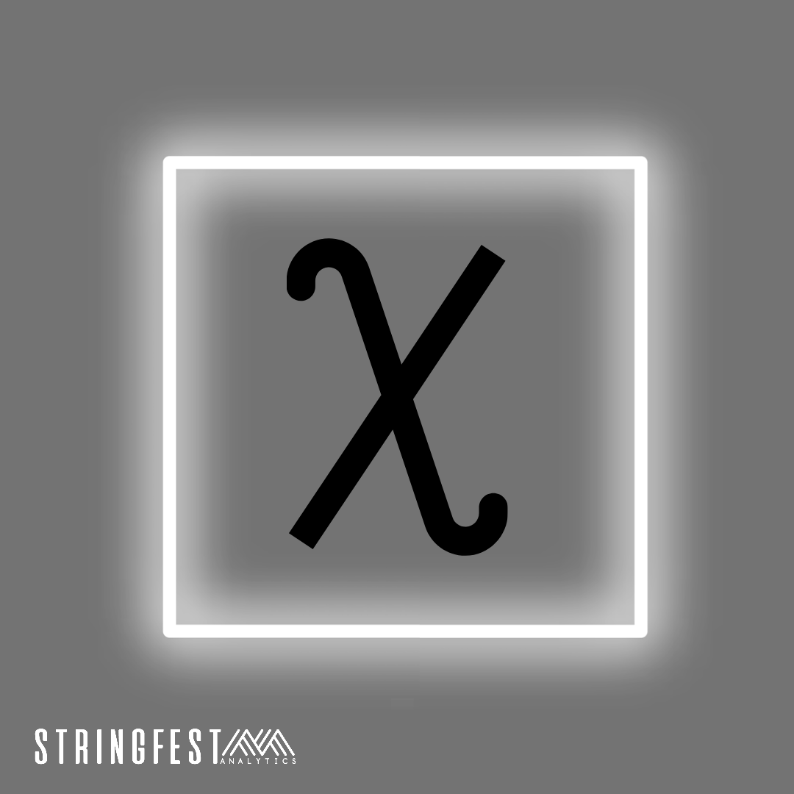

# Data brain teasers

Data brain teasers, brought to you by Stringfest Analytics.

Check the [`solutions.md` file in this repo](https://github.com/stringfestdata/data-brain-teasers/blob/main/solutions.md) for the answers.

### For more analytics content, [subscribe at stringfestanalytics.com](http://stringfestanalytics.com). 

## 1

## 2

## 3

## 4

## 5

## 6

## 7

## 8

## 9

